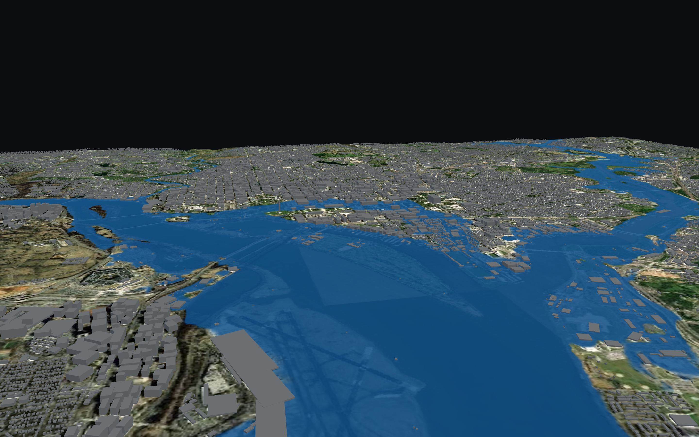

# DC Flood Sim

Live demo: **https://abhiramm7.github.io/dc-flood-sim/**

A 2D flood model of Washington DC (Potomac and Anacostia) that runs entirely
in your browser. The shallow-water equations are solved on your GPU, the 3D
city comes from OpenStreetMap, and the river inflows are pulled live from
USGS gauges. The whole thing is a static web page, so it costs nothing to
host and nothing to share.


*A simulated 100-yr flood (about 14,650 m³/s combined inflow) after several
hours of simulated time. National Airport and the Mall are underwater.
Everything in this picture was computed in the browser.*

## Why

Flood risk information mostly lives in static FEMA map panels or in
commercial models that cost real money. Meanwhile the raw ingredients are
free: USGS publishes lidar terrain and live gauge readings, OpenStreetMap
has building footprints, FEMA publishes its hazard layers. This project is
an attempt to wire those together into something you can actually play
with: drag a slider to 12,000 m³/s and watch which streets go under.

I want this to work for more cities than DC. The bake pipeline
(`export_web_assets.py`) takes a bounding box and produces everything the
site needs, so adapting it elsewhere is mostly a matter of pointing it at a
different DEM.

To be clear about what this is: a research and education tool. It has not
been validated against a historical flood yet, and no one should make
decisions with it. See [limitations](#limitations).

## How it works

There are two implementations of the same physics:

1. Python + Taichi on the Mac GPU (Metal). The numbered scripts
   (`01_…` to `05_…`) handle data prep, experiments, and eventually
   validation.
2. WebGL2 fragment shaders. [`docs/`](docs/) is a fully static site that
   runs the identical scheme in ping-pong float textures, an approach
   borrowed from [WebFlood](https://aeplay.github.io/WebFlood/). GitHub
   Pages serves the files; the visitor's GPU does the hydraulics.

The numerical scheme is the LISFLOOD-FP style local-inertial approximation
of the shallow-water equations (Bates, Horritt & Fewtrell 2010; de Almeida
et al. 2012): explicit face fluxes with semi-implicit Manning friction,
mass conservation per cell, wetting and drying, a CFL-limited timestep, and
critical-flow weir outflow at the domain edges. The DC grid is about a
million cells at 20 m resolution and runs a few thousand times faster than
real time on an ordinary laptop GPU.

## Data sources

All of it is open data.

| Data | Source | How it gets here |
|---|---|---|
| Terrain (DEM) | USGS 3DEP lidar via [`py3dep`](https://github.com/hyriver/py3dep), or the 2021 USGS Topobathy Lidar for the Potomac (includes the riverbed) from [NOAA Digital Coast](https://coast.noaa.gov/dataviewer/) | `01_acquire_dem.py` downloads and clips it (EPSG:32618); `export_web_assets.py` downsamples to 20 m, quantizes to uint16, and gzips it |
| River discharge and tidal stage | [USGS NWIS](https://waterservices.usgs.gov) instantaneous values. Inflows: 01646500 Little Falls, 01649500 and 01651003 Anacostia branches, 01648000 Rock Creek. Tidal stage: 01647600, 01651827 | The web page fetches these on load and every 10 minutes. The tidal stage sets the initial river level (a connectivity flood-fill up to the NAVD88 elevation); the discharges preset the inflow sliders |
| Buildings | OpenStreetMap via the [Overpass API](https://overpass-api.de) | `export_web_assets.py` fetches every `building` way in the bounding box, fits an oriented box and height to each footprint, and packs ~236k of them into a 5 MB binary that renders as a single `InstancedMesh` |
| Flood hazard zones | FEMA National Flood Hazard Layer | queried from the NFHL MapServer, slimmed, and gzipped |
| Aerial imagery | Esri World Imagery tiles (© Esri and contributors, used with attribution) | `export_web_assets.py` fetches ~130 tiles and resamples them onto the model grid as the terrain texture |

## Quick start

The shared site is static, so running it locally takes one command:

```bash
python3 -m http.server 8901 --directory docs
# open http://localhost:8901/
```

Rebuilding the data pipeline (macOS, Apple Silicon):

```bash
python3 -m venv .venv && source .venv/bin/activate
pip install taichi numpy matplotlib py3dep rioxarray rasterio xarray scipy pillow

python 01_acquire_dem.py            # fetch and clip the DEM
python export_web_assets.py         # bake docs/data/* (DEM, buildings, imagery, gauges)
python webviz_server.py             # optional: live Taichi/Metal viewer on :8765
```

[`docs/README.md`](docs/README.md) covers the web app internals, hosting,
and browser requirements. [`flood_modeling_plan.md`](flood_modeling_plan.md)
is the modeling design doc.

## Repository map

| Path | What |
|---|---|
| `01_acquire_dem.py` … `05_validate.py` | the numbered modeling pipeline: acquire, extract channels, solve, run, validate |
| `03_solver_swe.py` | the reference Taichi/Metal solver |
| `webviz_server.py` + `webviz/` | live local viewer (Taichi solver streaming to the browser over WebSocket) |
| `export_web_assets.py` | bakes the static assets for the shareable site |
| `docs/` | the shareable site: `sim.js` is the GPU solver, `main.js` the viewer, `data/` the baked assets |

## Limitations

- Not validated. The plan is to drive the model with a historical flood's
  USGS discharge record and compare modeled stage against the gauge, but
  that hasn't happened yet. Until it does, treat the output as
  illustrative.
- Buildings are scenery. They don't block flow; the solver sees bare earth
  with uniform Manning roughness.
- Inflows are steady values at four gauges, and the downstream boundary is
  a free weir at the domain edge. The results are only as good as those
  boundary conditions.
- 20 m grid, single precision, no storm drains, no tide or surge forcing.

## Roadmap

- Validate against historical events (Isabel 2003, the 1936 flood)
- Make buildings obstruct flow (stamp footprints into the bed elevation or
  the roughness map)
- Play back real hydrographs from NWIS instead of steady sliders
- Click to probe depth; color water by depth; drape the FEMA zones in 3D
  for comparison
- Generalize the bake pipeline to any US bounding box

## License

Code is under the GNU General Public License v3.0; see [LICENSE](LICENSE).

The data keeps its providers' terms: USGS and FEMA data are US public
domain, OpenStreetMap data is © OpenStreetMap contributors under the
[ODbL](https://www.openstreetmap.org/copyright), and the aerial imagery in
`docs/data/basemap.jpg` is © Esri and its imagery partners, included here
for visualization with attribution.

## Acknowledgements

- [WebFlood](https://aeplay.github.io/WebFlood/), which showed that a flood
  solver can live in browser shaders
- Bates, Horritt & Fewtrell (2010, *J. Hydrology*) and de Almeida et
  al. (2012, *Water Resources Research*) for the numerical scheme
- [Taichi](https://www.taichi-lang.org/), [three.js](https://threejs.org/),
  and the [HyRiver](https://docs.hyriver.io/) stack
